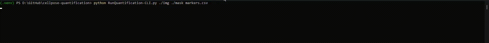

<h1 align="center">Cellpose-Quantification</h1>

A Python package for single-cell quantification using mask formats generated by [Cellpose](https://github.com/MouseLand/cellpose). This CLI tool analyses single-cell data by quantifying signal intensities and morphometric features from images and Cellpose masks.



---

## Installation

### Through pip (Recommended)
```bash
pip install cellpose-quantification
```

### Build From Source
1. Clone the repository:
   ```bash
   git clone https://github.com/milesbailey121/cellpose-quantification.git
   cd cellpose-quantification
   ```
2. Install build tools:
   ```bash
   pip install build setuptools wheel
   ```
3. Build the package:
   ```bash
   python -m build
   ```
4. Install the built wheel:
   ```bash
   pip install dist/cellpose_quantification-*.whl
   ```

---

## Usage

### Command Line (CLI)
After installation, run:
```bash
cellpose-quant ./path/to/images ./path/to/masks markers.csv
```

**With Normalisation**:
```bash
cellpose-quant ./path/to/images ./path/to/masks markers.csv --norm log/minmax
```

---

## Expected Output

The output is a CSV file containing quantitative information for each segmented cell. Below is an example:  

| Cell_ID | Nuclear   | CD31       | CK5       | SMA | Ki67       | CK8       | CCASP3      | area | centroid-0 | centroid-1 | perimeter | eccentricity | solidity   | orientation | Filename    |  
|---------|-----------|------------|-----------|-----|------------|-----------|-------------|------|------------|------------|-----------|--------------|------------|-------------|-------------|
| 1       | 12.622871 | 0.600973   | 0.571776  | 0   | 0.238443   | 0.002433  | 0.381995    | 411  | 200.211679 | 697.878345 | 96.041631 | 0.959712     | 0.942661   | 0.067159    | Image_1.tif |  
| 2       | 12.568093 | 0.256809   | 0.289883  | 0   | 0.114786   | 0         | 1.830739    | 514  | 244.719844 | 698.120623 | 115.213203| 0.974378     | 0.955390   | 0.045165    | Image_1.tif |  

This table contains:  
- **Quantitative marker data** (e.g., `DAPI`, `CK5`, `P53`, etc.)  
- **Morphometric properties** (e.g., `area`, `eccentricity`, `solidity`, etc.)  
- **Cell metadata**, such as coordinates (`centroid-0` e.g x-axis, `centroid-1` e.g y-axis) and file names (`Filename`).  

---

## Common Issues & Trouble Shooting

- TIFF images in `(channels, width, height)` format
- Corresponding masks in `.npy`, `.png`, or `.tif` format
- If masks aren't being recognized:
   - Ensure masks have same base filename as images
   - Verify masks are single-channel (2D arrays)

---

## Authors
Please cite this repository when using this tool!  
[Miles Bailey](https://github.com/milesbailey121)  
[@milesbailey121](https://twitter.com/milesbailey121)
```


