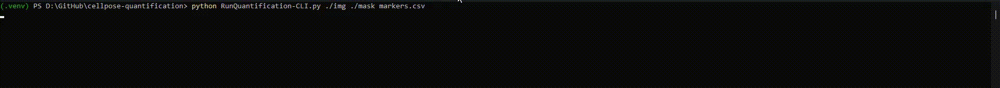

<h1 align="center">Cellpose-Quantification</h1>

A repository for single-cell quantification using mask formats generated by [Cellpose!](https://github.com/MouseLand/cellpose) This CLI tool enables the analysis of single-cell data by enabling the quantification of signal intensities and cell-specific features from images and corresponding masks.



<h2 align="center">Getting Started</h2>
<h3 align="center">Installing Dependancies</h2>

* Clone this git repository locally
* Setup Python environment and install packages

```
pip install -r requirements.txt
```
<h3 align="center">Executing program</h2>

This program can be run from the command line with the following example command:
```
python RunQuantification-CLI.py ./path/to/images ./path/to/masks markers.csv 
```
With Normalisation
```
python RunQuantification-CLI.py ./path/to/images ./path/to/masks markers.csv --norm log
```

<h3 align="center">Expected Parameters</h2>

* ./path/to/image
  * Can take Input from a directory containing tiff images
* ./path/to/masks
  * Can take a directory .npy, .png, and .tif masks as inputs generated by cellpose
* markers.csv
  * The path to metadata relating to markers corresponding to each markers, formatted on one row e.g. CD45, DAPI, Ki67, etc
* --norm
  * An optional parameter which defines a normalisation technique to use, current implementation allows: minmax and log normalisation. 
 
<h3 align="center">Expected Output</h2>

The output is a CSV file containing quantitative information for each segmented cell. Below is an example:  

| Cell_ID | Nuclear   | CD31       | CK5       | SMA | Ki67       | CK8       | CCASP3      | area | centroid-0 | centroid-1 | perimeter | eccentricity | solidity   | orientation | Filename    |  
|---------|-----------|------------|-----------|-----|------------|-----------|-------------|------|------------|------------|-----------|--------------|------------|-------------|-------------|
| 1       | 12.622871 | 0.600973   | 0.571776  | 0   | 0.238443   | 0.002433  | 0.381995    | 411  | 200.211679 | 697.878345 | 96.041631 | 0.959712     | 0.942661   | 0.067159    | Image_1.tif |  
| 2       | 12.568093 | 0.256809   | 0.289883  | 0   | 0.114786   | 0         | 1.830739    | 514  | 244.719844 | 698.120623 | 115.213203| 0.974378     | 0.955390   | 0.045165    | Image_1.tif |  

This table contains:  
- **Quantitative marker data** (e.g., `CD31`, `CK5`, `ANXA1`, etc.)  
- **Morphometric properties** (e.g., `area`, `eccentricity`, `solidity`, etc.)  
- **Cell metadata**, such as coordinates (`centroid-0` e.g x-axis, `centroid-1` e.g y-axis) and file names (`Filename`).  

## Authors
Please cite this git page when using this tool!
[Miles Bailey](https://github.com/milesbailey121)  
[@milesbailey121](https://twitter.com/milesbailey121)
